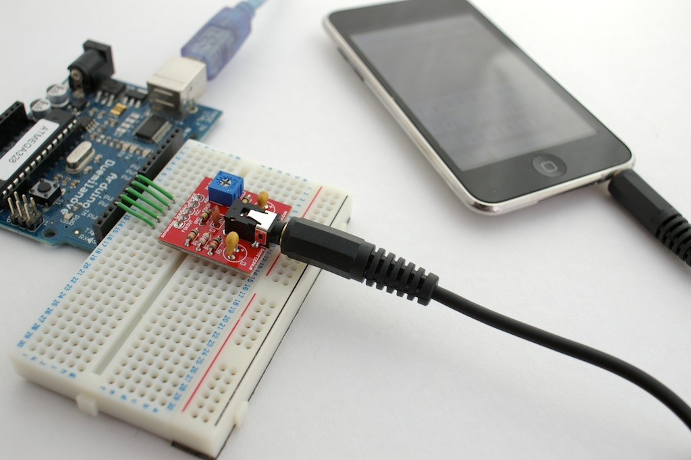
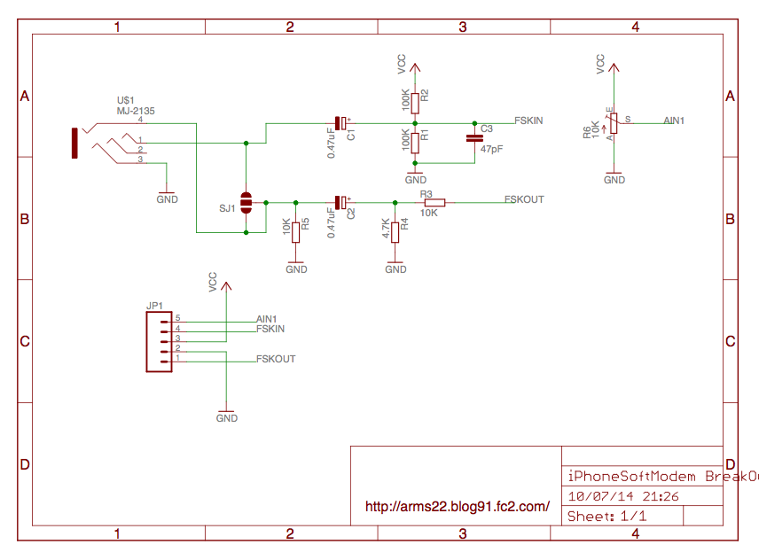

SoftModem
====

SoftModem is a wired, low-cost and platform independent solution for communication between an Arduino and mobile phones. It uses the phone's audio jack and Bell 202 modem-like FSK encoding with up to 1225 bit/s. Check out this [blog post](http://translate.google.com/translate?js=y&prev=_t&hl=en&ie=UTF-8&layout=1&eotf=1&u=http%3A%2F%2Farms22.blog91.fc2.com%2Fblog-entry-350.html&sl=auto&tl=en).


Projects based on SoftModem:

- [SoftModemTerminal](https://github.com/arms22/arms22/tree/master/SoftModemTerminal) by Arms22: an iOS SoftModem terminal application
- [FSK-Serial-Generator](https://github.com/NeoCat/FSK-Serial-Generator-in-JavaScript) by NeoCat: a JavaScript transmitter implementation
- [WebJack](https://github.com/publiclab/webjack) by PublicLab: a JavaScript transmitter and receiver, compatible with [Firmata.js](https://github.com/firmata/firmata.js/)/[Jonny-Five](http://johnny-five.io/)


### Install via Arduino Library Manager
Open the Arduino Library Manager from the menu: `Sketch → Include Library → Manage Libraries...`. 
Then search for 'SoftModem' and click install.

### Manual install
Create a folder 'SoftModem' inside your `libraries` folder and place these files there. 

## Supported Boards

- ATmega328: Arduino Uno / Nano / Pro / Pro Mini / Fio
- ATtiny85, ATmega32U4: not implemented yet, contributions welcome!


|       Board      | TX pin | RX pin | AIN1 pin | Timer | Notes |
|:----------------:|:------:|:------:|:--------:|:-----:|:-----:|
|    Arduino Uno   |    3   |    6   |     7    |   2   |       |
|                  |        |        |          |       |       |


## Usage
This is an example sketch that forwards data to/from the serial port.

```Arduino
#include <SoftModem.h>

SoftModem modem = SoftModem();

void setup() {
  Serial.begin(115200);
  Serial.println("Booting");
  delay(100);
  modem.begin();
}

void loop() {  
  while(modem.available()){
    int c = modem.read();
    if(isprint(c)){
      Serial.print((char)c);
    }
    else{
      Serial.print("(");
      Serial.print(c,HEX);
      Serial.println(")");      
    }
  }
  if(Serial.available()){
    modem.write(0xff);
    while(Serial.available()){
      char c = Serial.read();
      modem.write(c);
    }
  }
}
```

### Notes
SoftModem uses Timer2, therefore you can not make use of the `analogWrite()` function for  pins 3 and 11 in your sketch.

### Hardware
A shield is available [here](https://www.switch-science.com/catalog/600/) or [here](http://www.elechouse.com/elechouse/index.php?main_page=product_info&cPath=90_92&products_id=2199). You can also build your own. Here is the schematic:



##License
[BSD 3](https://github.com/arms22/SoftModem/blob/master/LICENSE)